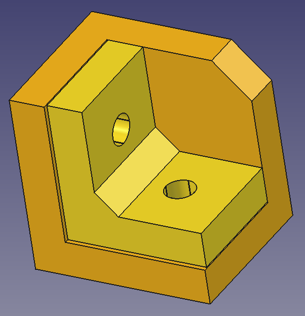

# Corner clamp (parametric FreeCAD)



Two-piece 90 degree corner clamp: an outer L with base and side walls,
and an inner L that nests inside. Geometry is built by
`corner_clamp_generator.py` and saved as a FreeCAD document.

## Repository files

- `corner_clamp_generator.py` - parametric script (constants at top)
- `pyproject.toml` - project metadata and `corner-clamp-generator` CLI
- `Corner_Clamp.FCStd` - generated model (outer and inner solids)
- `corner_clamp_screenshot.png` - CAD screenshot (see above)
- `corner_clamp.png` - reference image

## Requirements

- Python 3.10+ for CLI help and optional [uv](https://docs.astral.sh/uv/)
  workflow (`uv sync`, `uv run`).
- [FreeCAD](https://www.freecad.org/) with a headless CLI to build geometry.
  On Ubuntu via snap, the command is usually `freecad.cmd` (also
  `snap run freecad.cmd`).

FreeCAD provides `FreeCAD`, `Part`, and related modules; they are not
installed by this project's Python environment.

## CLI help

Show script options (no FreeCAD needed):

```bash
python corner_clamp_generator.py -h
```

With uv after `uv sync`:

```bash
uv run corner-clamp-generator -h
uv run corner_clamp_generator.py -h
```

`freecad.cmd corner_clamp_generator.py -h` prints FreeCAD's own help
because the launcher handles `-h` before the script runs. Use `python` or
`uv run` for this script's help.

## Run the generator

With uv installed (`uv sync`), the console script re-invokes `freecad.cmd`
when FreeCAD is not in the venv Python:

```bash
corner-clamp-generator --arm-length 200 --height 200
```

Or call FreeCAD directly from this directory:

```bash
freecad.cmd corner_clamp_generator.py
```

If `freecad.cmd` is not on your PATH:

```bash
snap run freecad.cmd "$(pwd)/corner_clamp_generator.py"
```

Pass dimension overrides after the script name, for example:

```bash
freecad.cmd corner_clamp_generator.py --arm-length 120 --height 50
```

The script prints saved path, part volumes, and whether each solid is
valid. Open the resulting `.FCStd` in the FreeCAD GUI to inspect or
export meshes.

Each run writes a file in the current working directory. The base name
comes from `OUTPUT` in the script (for example `Corner_Clamp.FCStd`), but
the generator inserts three dimension numbers before the extension:

```text
<stem>_<arm-length>_<height>_<magnet-diameter>.FCStd
```

All three suffix values are millimeters, matching `--arm-length`,
`--height`, and `--magnet-diameter`. With defaults you get
`Corner_Clamp_100_60_10.FCStd`. Wall thickness, clearance, and other
flags are recorded in the document Comment, not in the filename. Change
`OUTPUT` at the top of the generator script to use a different stem or
extension.

## Design defaults

- Envelope: 100 mm arms, 60 mm height, 12 mm walls
- Magnets: nominal 10 mm diameter x 3 mm thick; one pair per L leg
- Pockets: straight 9.8 mm diameter x 3.1 mm deep press-fit holes
- 1 mm membrane at each mating face so magnets cannot touch
- Inner legs: 0.4 mm clearance on nested sides, under the inner piece
  (+Z lift), and at the top; outer corner 45 degree chamfer on the square
  wall profile

## Customize

Use CLI flags from `-h`, then run the generator again. Each `.FCStd`
includes a `Parameters` object with key dimensions. The scripts also set
document **Comment** metadata to the full CLI invocation (every flag and
value) used for that build.

## FCStd comments

`.FCStd` files are ZIP archives. The document-level comment lives in
`Document.xml` inside `<Property name="Comment">`.

Quick grep:

```bash
unzip -p file.FCStd Document.xml | grep -A 1 'name="Comment"'
```

XPath with `xmllint` (recommended):

```bash
unzip -p file.FCStd Document.xml | \
  xmllint --xpath 'string(//Property[@name="Comment"]/String/@value)' - \
  2>/dev/null
```

All object `Label2` strings in the same file:

```bash
unzip -p file.FCStd Document.xml | \
  xmllint --xpath '//Property[@name="Label2"]/String/@value' - \
  2>/dev/null
```

Headless FreeCAD (uses the document API; slower for batch jobs):

```bash
freecad.cmd -c "import FreeCAD; doc=FreeCAD.openDocument('file.FCStd'); \
  print(doc.Comment)"
```

Document comment plus per-object `Label2`:

```bash
freecad.cmd -c "import FreeCAD; doc=FreeCAD.openDocument('file.FCStd'); \
  print('Doc Comment:', doc.Comment); \
  [print(f'{obj.Name}: {obj.Label2}') for obj in doc.Objects \
  if hasattr(obj, 'Label2') and obj.Label2]"
```

For many files in a shell pipeline, `unzip` plus `xmllint` is usually
faster than starting FreeCAD for each archive.
